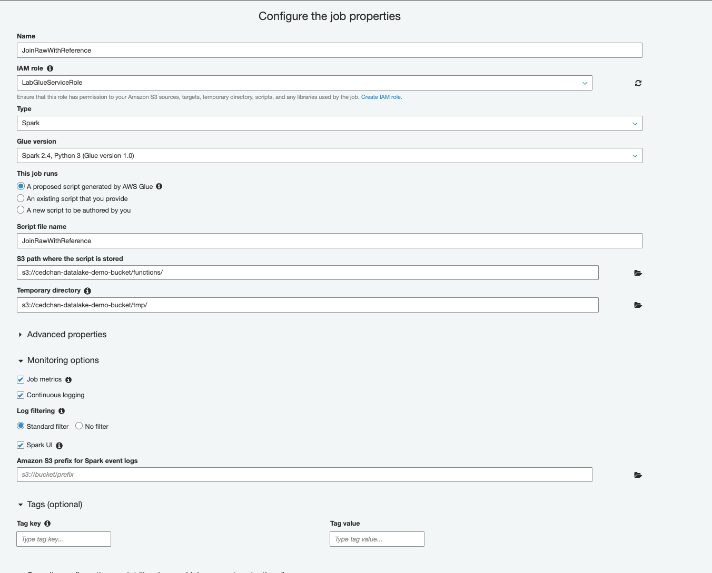
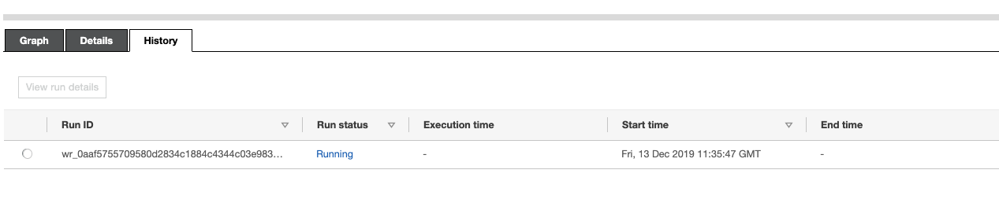

# Part 3 : Data Transformation using serverless Spark 

_(To perform this lab using Sagemaker Notebooks and Dev Endpoints instead, go [here](../lab3_nb/))_

A Glue Development Endpoint is an environment for you to develop and test your Glue scripts / jobs.
Configuring a Development Endpoint spins up the necessary network and machines to simplify ETL scripting with AWS resources in a VPC. 

In this lab, you will be joining two separate dataframes: one from the `raw` datasets from Firehose against a manually uploaded reference dataset.

The raw dataset contains list of tracks, devices and activities from Firehose. 
The reference dataset contains a list of tracks, track titles and artist names.

You will be using Glue to perform basic transformations such as filtering and joining. 

## 1. Upload and Crawl a Reference Dataset
In this step, you will upload and crawl a new Glue dataset from a manual JSON file.

1. Open your S3 Bucket **YOUR_USERNAME-datalake-demo-bucket*: https://s3.console.aws.amazon.com/s3/home?region=us-east-1#
2. Open the subfolder **data**, and create a subfolder called **reference_data**. Your bucket should look like this: 

    ```
    *--YOUR_USERNAME-datalake-demo-bucket
         │
         ├── data/
         │     └── raw/
         │     └── reference_data/
         │     
         │
         └── (..other project assets: code etc.)
    ```
3. Download the following file [tracks_list.json](https://raw.githubusercontent.com/czhc/serverless-datalake-on-aws/master/lab3/tracks_list.json), and upload it into the `reference_data/` folder.

4. Open the Glue crawler console. Select the crawler you have created **CrawlDataFromKDG** and **Run crawler**.
	1. The crawlwer picks up new data in the S3 bucket and automatically creates new tables in the database
	2. Notice how this creates two new Glue tables for `raw` and `reference_data`. 

## 2. Create a Job
In this step you will be creating a transformation to join and filter the `raw` and `reference` data using Glue ETL Jobs.

1. Go to the jobs tab in Glue ETL: https://console.aws.amazon.com/glue/home?region=us-east-1#etl:tab=jobs
2. Click on **Add job**
3. Create a Job with the following properties: 
	* Name: **JoinRawWithReference**
    	* IAM role: **AWSGlueServiceRoleLab**
	* Type: **Spark**
	* Type: **Spark 2.4, Python 3 (Glue 1.0)**
	* This job runs: **A proposed script generated by AWS Glue**
	* Script file name: join_data.py
	* S3 path where the script is stored: **s3://<YOUR_USERNAME>-datalake-demo-bucket/jobs/**
	* Temporary directory: **s3://<YOUR_USERNAME>-datalake-demo-bucket/tmp/**
	* Monitoring options: :ballot_box_with_check: Job metrics, Continuous logging and Spark UI
	* Amazon S3 prefix for Spark event logs: **s3://<YOUR_USERNAME>-datalake-demo-bucket/logs**
	* Security configuration, script libraries and job parameters:
		* Maximum capacity: **2**
	* Click on Next
	

4. Choose a data source: **raw**
5. Choose a transform type: **Change schema**
6. Choose a data target: 
	* Create tables in your data target
	* Data store: Amazon s3
	* Format: Parquet
	* Target path: **s3://<YOUR_USERNAME>-datalake-demo-bucket/data/processed/**
7. Map the source columns to target columns
	* Delete :x: the columns for *partition_0*,*partition_1*,*partition_2*,*partition_3*
	* Add column: add columns for **track_name** and **artist_name**. Select the column type as **string**
8. **Save job and edit script**


9. You are now taken to the template builder for your job. In this workspace, you can use the options on the top right: Source, Target, Target Location, Transform and Spigot to build your ETL Job.
	* View the contents of the generated python script. 
	* View the generated diagram on the left of the code panel. This diagram is generated using annotations used in script. Click on each step of the workflow to see the corresponding annotation.

	

10. You can use the following steps to update your script. Alternatively, you can copy this following code snippet [join.py](./join.py) to replace the script.
	*  

11. Click on **Generate diagram** to verify the workflow. You should see a similar diagram: 
		

12. Click on **Save** and **Run job**.
	* Review and override the job parameters if needed. In this demo, we can skip this and **Run job** immediately.
	* Observer the Progress bar and logs for changes. 
	* The job may take an estimate of 8 minutes to complete

13. After the job has completed, we can add the processed data to our Glue Data Catalog by re-running our `CrawlDataFromKDG` crawler
	* Go to Crawlers. Check `CrawlDataFromKDG` and **Run crawler**
	* Go to Tables. You should now have a new table `processed` with the correct S3 location and classification: `parquet`


## Validate - Transformed / Processed data has arrived in S3

Once the ETL script has ran successfully, you can inspect the output of the Glue job 

1. Look into your S3 Bucket: **YOUR_USERNAME-datalake-demo-bucket/data/processed_data**
2. Inspect the new Glue table `processed_data` using Athena


## 3. Create a scheduled transformation with Glue Workflow

In this step, we will create a Workflow to execute our Job

1. Go to Glue Workflows: https://console.aws.amazon.com/glue/home?region=us-east-1#etl:tab=workflows and Add workflow
2. Use a workflow name **JoinProcessedDataHourly** and *Add workflow* 

	

3. Select your workflow **JoinProcessedDataHourly** and look at the workspace at the bottom panel.
4. Click on **Add trigger**
	1. We must first add a trigger to start the job. We can create and reuse triggers for different Workflows.

	

	2. Click on **Add new**
	3. Fill in the following details for a trigger:
		1. Name: **Hourly**
		2. Trigger type: **Schedule**
		3. Frequency: **Hourly**
		4. Start minute: **00** (or any nearest minute you'd like to observe)

5. Click on **Add note**
	1. Select your Job: `JoinRawWithReference`

	

6. You are done! Wait for the time to past and meet your scheduled minute.
	1. You can inspect the Job History tab to check on the execution of a Job
	

## Extra Credits

1. Explore more built-in transformations provided by Glue: [Built-in Transforms :arrow_forward:](https://docs.aws.amazon.com/glue/latest/dg/built-in-transforms.html)
2. Explore other Glue configurations such as Bookmarks to pass job state parameters.
3. Explore the Glue developer guide here: [PDF :arrow_forward:](https://docs.aws.amazon.com/glue/latest/dg/glue-dg.pdf) 

