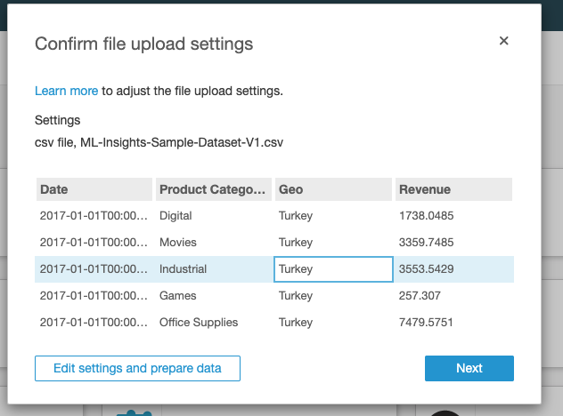
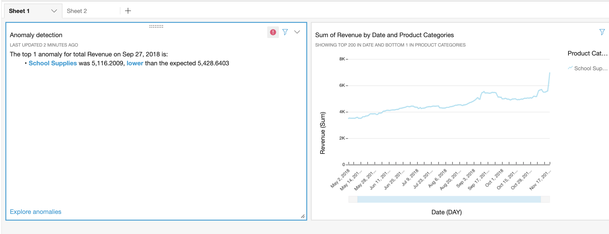

# Part 4: Visualize Data with Amazon Quicksight

## Setting Up QuickSight

In this step we will visualize your datasets using QuickSight

Login to Amazon Quick Sight Console & complete the registration & sign-up

* GoTo: https://us-east-1.quicksight.aws.amazon.com/sn/start
* You may be asked to Sign Up for Quicksight. Proceed to Create your QuickSight account with an Enterprise plan.
* Create your QuickSight account:
	* Edition: **Use Role Based Federation(SSO)**
	* QuickSight region: **US East (N. Virginia)**
	* QuickSight account name: **YOUR_USERNAME**
	* Check the following:
		* Enable autodiscover of data and users in your Amazon Redshift....
		* Amazon Athena
		* Amazon S3: Select **YOUR_USERNAME-datalake-demo-bucket** > **Select buckets**
		* **Go to Amazon Quicksight**
		
Note: if you have errors creating a Quicksight account, it is possible that the username has already been in-use. Try again with a unique username

Welcome to the QuickSight console!

## Adding a New Dataset

* GoTo: https://us-east-1.quicksight.aws.amazon.com/sn/start
* On top right, Click - **Manage Data**
    * Click - **New Data Set**
    * Click - **Athena** 
    * New Athena data source
        * Data source name: **awslabs_db**
    * Choose your table:
        * Database: contain sets of tables: select - **awslabs_db**
        * Tables: contain the data you can visualize : select - **processed_data**
        * Click - **Select**
    * Finish data set creation:
        * Select - **Import to SPICE for quicker analytic**
	* SPICE is Amazon QuickSight's in-memory optimized calculation engine, designed specifically for fast, ad hoc data visualization
        * Click **Visualize**

## Using Amazon Quick Sight to Visualize Our Processed Data

###  Visualization 1: Heat map of users and tracks they are listening to

In this step, we will create a visualization that show us which users are listening to repetitive tracks.

* On the bottom-left panel - **Visual types**
    * Hover on icon there to see names of the visualizations
    * Click on - **Heat Map**
* On top-left panel - **Fields list**
    * Click -  **device_id**
    * Click - **track_name**
* Just above the visualization you should see **Field wells** : [**Rows - device_id**] [**Columns - track_name**]

If you hover on dark blue patches on the heatmap you will see that those particular users are listening to same track repeatedly.

### Visualization 2: Tree map of most played Artist Names

In this step we will create a visualization that shows who are the most played artists

* On top-left - Click on '**+ Add**' > **Add Visual**, this will add a new panel to the right pane
* On the bottom-left panel - **Visual types**
    * Hover on icon there to see names of the visualizations
    * Click on - **Tree Map**
* On top-left panel - **Fields list**
    * Click - **artist_name**

Play around and explore Amazon QuickSight Console. Try out filters, other visualization types, etc.

## Using ML Insights for Forecasting and Anomaly Detection

In this step, we will explore generating narratives for data sets using built-in ML capabilities in Quicksight.
ML Insights have [minimum requirements](https://docs.aws.amazon.com/quicksight/latest/user/ml-data-set-requirements.html) for data sets based on granularity and data size.

For this lab, we will use a sample dataset that looks like this. 

|Date|Product Categories|Geo|Revenue|
|:-:|:--:|:--:|:--:|
|1/1/17|Digital|Turkey|1738.04848|
|1/1/17|Movies|Turkey|3359.74848|

### Prepare the data set

1. Download the sample data .csv [here](./qs-sample.csv)
2. Add a New Data Set here: [Manage Data sets](https://us-east-1.quicksight.aws.amazon.com/sn/data-sets)
	1. Click on New data set
	2. Upload a file
	
	3. Review the file contents and click on Next > Visualize data
	
3. Build a simple time series Visual for the data set.
	1. Click on the Line Chart visual at the bottom panel Visual types
	2. Click on **Date**, **Revenue** and **Product Categories** in that order.
	
	
	
### Explore ML-powered Insights

1. Click on the **Insights** tab on the left navigation.
2. Observe the **Suggested insights** on the side panel. You may see suggested insights for:
	1. Top 2 performing Product Categories for _School Supplies (+12.27%)_ and _Home Services (+0.6%)_
	2. Total Revenue compounded growth rate of _0.06%_ over 30 days
	3. Significant Day-Over-Day Revenue decrease on Nov 17
	
	
3. Add the Suggested Insights to your Sheet by clicking on :heavy_plus_sign:

## Filtering Data using Filters

Let's filter for a single timeseries chart. 

1. Click on Filter in the side navigation.
2. Select the :heavy_plus_sign: and **Product Categories**
	1. Select Filter type: **Filter list**
	2. Search and select **School Supplies**
	3. Click **Apply**
	
	
3. In the visual, select the v-shaped dropdown, and select **Hide "other" categories**

	

4. Explore other options for filtering data, such as *Custom filters for String matching*, *OR operators* and *Datetime range filters*
	

## Custom Insights using Autonarratives

Autonarrative is a natural-language summary for text descriptions to simplify understanding a visual. [See a list of Autonarrative options](https://docs.aws.amazon.com/quicksight/latest/user/auto-narratives.html)

1. On the Growth rate insight, click on the dropdown icon and **Customize narrative**
2. Build your own insights using Computations, Parameters and Functions.

## Exploring Anomalies 

1. In the Insights tab again, click on **Add anomaly to sheet**
	1. In Configure anomaly detection, select **Analyze all combinations of these categories**
	2. Select **Run now**.
2. The result of the Anomaly Detection suggests a _lower than expected Revenue for Sept 27 2018_

	

3. Click on **Explore Anomalies** to filter Anomaly analysis by Severity, Direction and more. 

## Forecasting

1. Change the timeseries visual into a timeseries aggregated by Revenue. Click on the visual and remove the **Color: Product Categories** dimension.
2. In the visual, click on the dropdown menu, and select **Add forecast**
3. Observe the generated Revenue forecast including values for *Expected*, *Upper bound* and *Lower bound*.

	
	
4. Edit the forecast for parameters on *Periods forward*, *Periods backward*, *Interval* and *Seasonality* to fine-tune the predicted values.

## Exploring additional QuickSight features

Checkout the [Quicksight Youtube Channel](https://www.youtube.com/channel/UCqtI0cKSreCwUUuKOlA1tow) for more! :arrow_forward:
